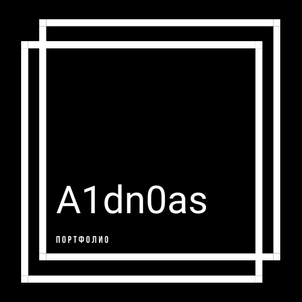

# Портфолио
## Галактионов Максим Алексеевич
## Студент 4-ого курса
## Высшее Учебное Заведение
## РГПУ им.Герцена

Вы можете посмотреть структуру проекта [по данной ссылке](https://github.com/A1dn0as/https-a1dn0as.github.io/edit/main/docs/index.md), для полного понимания как устроен этот сайт.

В данном портфолио будут представлены лабораторные работы по:

- [Работы Герцена](https://github.com/A1dn0as/herzenworks)
- [Базы Данных](https://github.com/A1dn0as/DataBaseHerzen)
- [ОКА](https://github.com/A1dn0as/OKA)
- [ТТППИ](https://github.com/A1dn0as/ttppi)
- [Практикум по программированию](https://github.com/A1dn0as/practicumLr4)
- [Дата Базы](https://github.com/A1dn0as/DataBaseHerzen)
- [Веб-Программирование](https://codepen.io/a1dn0as/pen/ZEXbVjQ)
- [Веб-Программирование](https://codepen.io/lazytownman/pen/vYWVrvL)
- [Практика 7 курс](https://drive.google.com/drive/folders/10MOLd5ygfJwdMDu85Ogpjk2GNAj2dmPa?usp=sharing)
- [Защита информации](https://drive.google.com/drive/folders/1D13PkMyj9bDo8WJ_8hImPC1hGG7LMIg7?usp=sharing)
- [Оценка персонала](https://drive.google.com/drive/folders/1Uw0LMLUe2qTjdCf94qbB4LXNP6elCk5t?usp=sharing)

В каждой из ссылок на курс, есть файлы лабораторных работ, которые были выполнены в процессе обучения.

### Support or Contact
mainmgalaktionov@gmail.com

